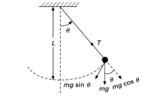

# THEORY

The study of pendulums provides insight into the principles of rotational dynamics and simple harmonic motion. In this experiment, we explore the mass moment of inertia for both simple and compound pendulums.

## Simple Pendulum:

A simple pendulum is a theoretical model consisting of a point mass (called the bob) suspended from a fixed point by a weightless, inextensible string or rod. The bob is free to swing back and forth under the influence of gravity. The motion of the simple pendulum can be described as harmonic motion, particularly for small angular displacements where the motion approximates simple harmonic motion.

## Period of a Simple Pendulum:

For small angular displacements, the period 𝑇 of a simple pendulum is given by:

The net torque is proportional to the angular acceleration α ⃗ of the body and shall exist during the entire time the torque acts. The equation is given as

where:
𝑇 is the period of one complete oscillation.
𝐿 is the length of the pendulum.
𝑔 is the acceleration due to gravity 

## Calculating the Mass Moment of Inertia::

Mathematically, the moment of inertia of a simple pendulum can be defined as the ratio of the torque due to gravity about the pivot point to the angular acceleration about that pivot point. For a simple pendulum, this ratio is found to be equal to the product of the mass 𝑚of the bob and the square of its distance 𝑟 from the pivot that is: 

where 𝑟 is the distance from the pivot point to the center of mass. In the case of a simple pendulum, 𝑟=𝐿, so:

                                                ……………………………………(I)

the formula is derived from the definition of momentum of inertia where 𝑚 is considered as mass and 𝐿 is the length from the pivot. (source)
Now, consider the dynamics of the simple pendulum,
When the pendulum is displaced by a small angle θ, the restoring torque τ about the pivot point is given by

For small angles (θ in radians), sinθ ≈ θ:

Newton's second law gives the equation of motion for rotational systems for rotation: 

  τ=Iα                                                     ……………………………………(ii)

Where α is the angular acceleration. For small displacements:
  α=(∂^2 θ)/(∂t^2 ) 
  
Substituting the torque expression for torque and angular acceleration in eq(ii):

Rearranging this equation:

This is a simple harmonic motion equation of the form:

Comparing with eq(iv), we obtain 

The period T of the pendulum is related to the angular frequency by:

So, For a simple pendulum, the known period T is also given by:

## Compound Pendulum:

A compound pendulum (or physical pendulum) is a more general form of a pendulum. Unlike the simple pendulum, which assumes a point mass at the end of a weightless rod, a compound pendulum consists of a rigid body swinging about a fixed horizontal axis. The entire mass of the pendulum is distributed along its length.
The parallel axis theorem relates the moment of inertia I about any axis parallel to and a distance h away from the axis through the center of mass (CM) I_cm :

I=I_cm+Mh^2

Where:
I_cm is the moment of inertia about the center of mass.
M is the total mass of the rigid body.
h is the distance from the pivot to the center of mass.

## Period of Oscillation:

The period T of a compound pendulum can be used to find the moment of inertia. The period of oscillation for small angles is given by:

 where:
𝐼 is the mass moment of inertia about the pivot.
m is the total mass of the pendulum.
𝑔 is the acceleration due to gravity.
L is the distance from the pivot to the center of mass.

## Calculating the Mass Moment of Inertia:

To verify the expression for I, consider the dynamics of the compound pendulum.
As, we already obtained the period T of the pendulum is related to the angular frequency :

By solving this equation for I:

## Moment of Inertia about the center of Mass:

  
  
